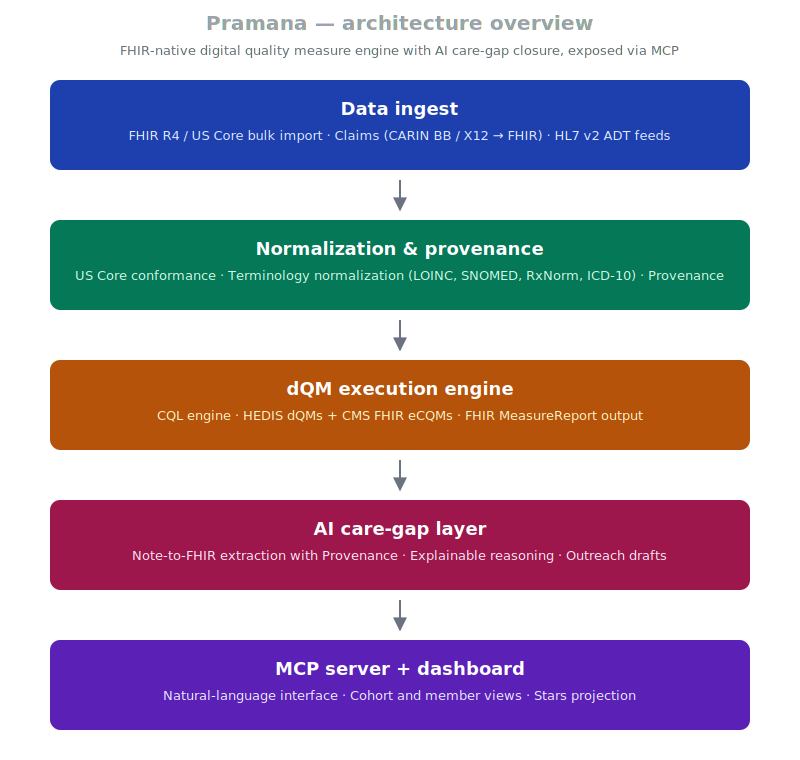

# fhir-dqm-engine

*Codename: **Pramana** (प्रमाण) — Sanskrit for "valid measurement, source of correct knowledge"*

> An open-source, FHIR-native digital quality measurement engine with an AI-powered care-gap closure layer — exposed via MCP. Built for the US healthcare transition from manual HEDIS chart abstraction to FHIR + CQL digital quality measures.

---

## Why this exists

Every Medicare Advantage plan, ACO, and FQHC in the United States is on a regulatory march from manual HEDIS chart abstraction to **FHIR-native Digital Quality Measures (dQMs)** specified in **CQL** — with NCQA's hybrid methodology fully retired by **measurement year 2029**.

The dollar value is enormous. Star Ratings — driven by HEDIS quality measures — move billions of dollars in Medicare Advantage Quality Bonus Payments every year. A one-Star jump can shift plan revenue by 13–17%. A one-Star decline can cost a major payer over a billion dollars.

Despite this, the open-source ecosystem for FHIR + CQL quality measurement is thin. Existing solutions are proprietary, expensive, and aimed at the largest payers. Mid-sized plans, ACOs, FQHCs, and the long tail of value-based care participants need something they can pick up, run, and extend.

**`fhir-dqm-engine` (Pramana) is that something.**

---

## What it does

1. **Ingests** clinical data in FHIR R4 / US Core format (plus FHIR-converted claims).
2. **Executes** CQL-based quality measures — both **HEDIS dQMs** (from NCQA) and **FHIR-based eCQMs** (from CMS programs).
3. **Identifies** open care gaps per member per measure, with provenance back to source resources.
4. **Augments** with a legitimate, audit-trailed AI layer:
   - Extracts structured evidence from unstructured clinical notes
   - Explains *why* a care gap is open, in plain language with citations
   - Drafts personalized member outreach (human-approved before send)
5. **Exposes** all of this via an **MCP server**, so care managers can interact in natural language.
6. **Projects** how gap closure translates into Star Rating movement and revenue impact.

Every clinical decision stays with a human. The AI clears the paperwork.

---

## Architecture

---

## Status

**Pre-alpha. Building in the open.**

This repository is currently scaffolding. Public commits will start as foundational layers are validated. A working v0.1 — three reference HEDIS measures (BCS-E, CBP-E, HBD-E) running end-to-end against a Synthea-generated FHIR dataset — is the first milestone.

Follow this repo or [my GitHub profile](https://github.com/pcmedsinge) for updates.

---

## Technology choices

| Layer | Choice | Why |
|---|---|---|
| Data standards | FHIR R4 + US Core 6.x | Lowest-friction US healthcare interop baseline |
| Quality measure language | CQL 1.5 | HL7 standard; published by NCQA and CMS |
| CQL execution | HL7 reference `cql-engine` (Java) | Most mature open-source engine |
| Application runtime | Python (FastAPI) + .NET 8 (HotChocolate) | Reuses patterns from related projects |
| Storage | Pluggable FHIR backend (HAPI, Azure FHIR, AWS HealthLake, etc.) | Engine should not be opinionated about your FHIR store |
| AI layer | LLM-agnostic (Claude / GPT / open-source) with mandatory Provenance | Auditability is non-negotiable |
| Interface | MCP server + FHIR REST + lightweight web dashboard | Conversation, integration, and visualization |

---

## Scope notes

**In scope (now):** FHIR-based HEDIS dQMs, FHIR-based CMS eCQMs (QI-Core and US Core flavors), MeasureReport generation, care-gap identification, AI-assisted extraction with provenance.

**Out of scope (for now):** QDM-based legacy eCQMs (older CMS measures using the Quality Data Model and QRDA XML — separate engine territory), formal certification for direct CMS or NCQA submission (the engine computes the same results; certified vendors can carry the final submission step).

---

## About the name

`fhir-dqm-engine` is the repository name — direct, searchable, says exactly what it is.

**Pramana** (Sanskrit: प्रमाण) is the project's identity. The word means *valid knowledge, proof, source of correct measurement* — in classical Indian philosophy, it refers specifically to the means by which one arrives at trustworthy knowledge. For an engine whose entire purpose is to make quality measurement trustworthy and verifiable, the fit felt right.

It also continues a thread from a sibling project — [`bodhi_app`](https://github.com/pcmedsinge/bodhi_app) (BODHI · ClinIQ) on the Bharat Ontology for Disease & Healthcare Informatics.

---

## How to follow along

- ⭐ Star this repo for updates
- 👤 Follow [@pcmedsinge](https://github.com/pcmedsinge) on GitHub
- 💼 Connect on [LinkedIn](https://linkedin.com/in/paragmedsinge)
- 📧 Reach out: paragmedsinge@yahoo.com

If you're a payer, ACO, FQHC, or just a quality-measurement nerd interested in the FHIR + CQL transition — collaboration, advisory conversations, and pilot partnerships are welcome.

---

## License

Apache License 2.0 — see [`LICENSE`](LICENSE).

---

## Acknowledgments

This work stands on the shoulders of the open standards and reference implementations from **HL7**, **NCQA**, **CMS**, the **Da Vinci Project**, the **CQF Tooling** community, and the **Synthea** team — and on the day-to-day labor of clinicians, informaticists, and care managers who keep the quality measurement system running.

---

*Built in the open by [Parag Medsinge](https://github.com/pcmedsinge) — at the intersection of healthcare interoperability, applied AI, and value-based care.*
